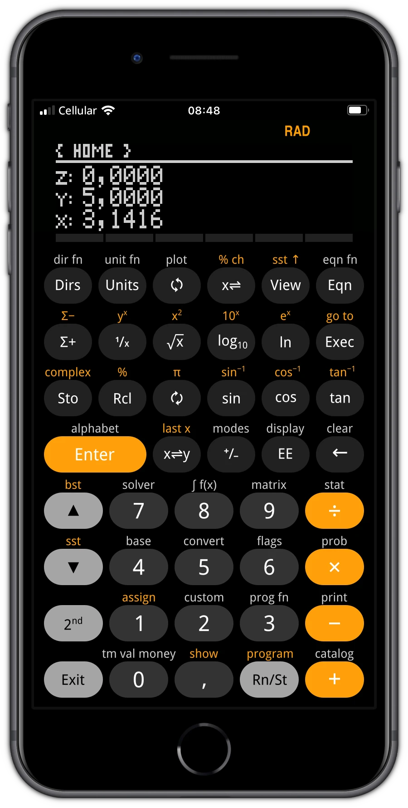
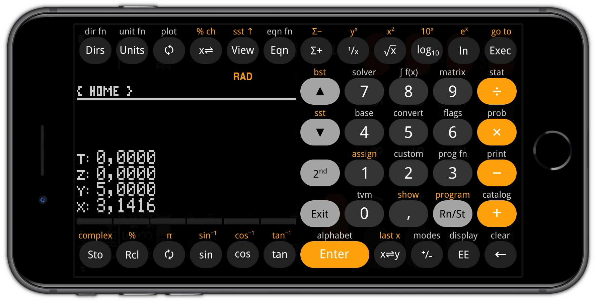
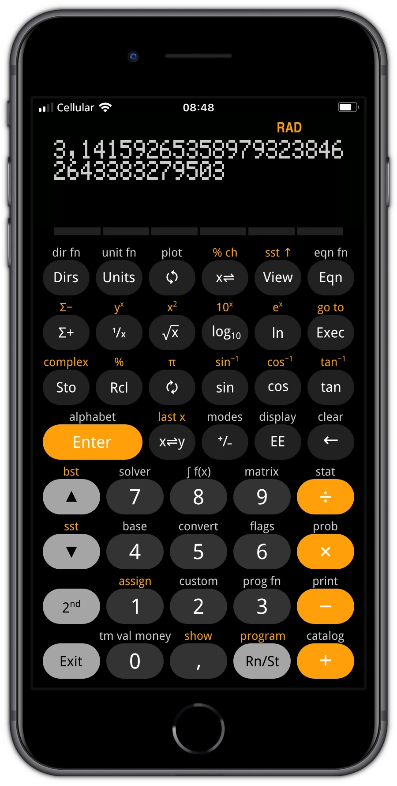
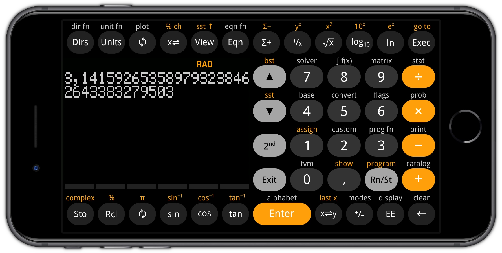
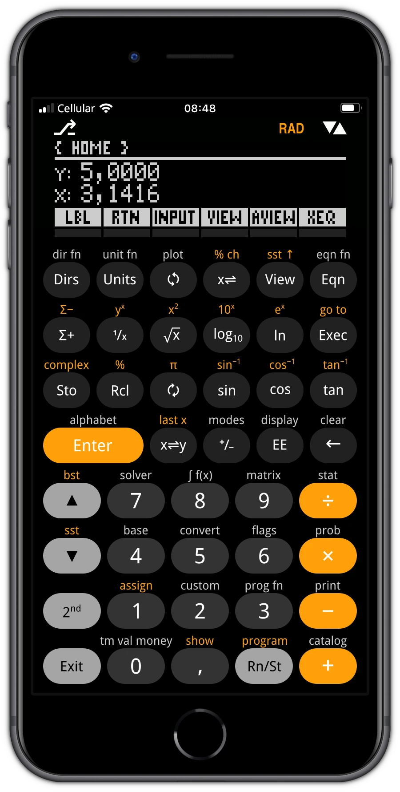
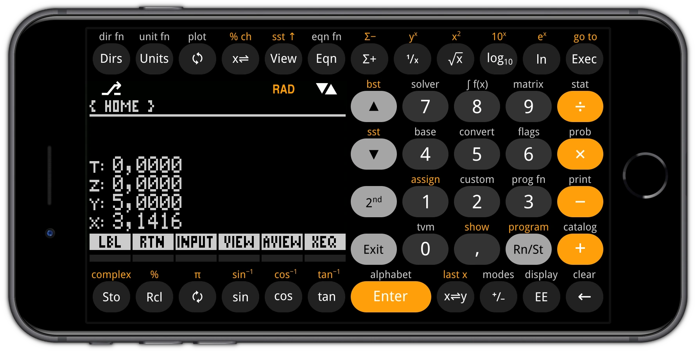

# Plus42 Skins

[Plus42](https://thomasokken.com/plus42/) is an improved emulator of [HP-42S](https://en.wikipedia.org/wiki/HP-42S) calculator. It was developed by Thomas Okken. Nowadays it runs on iOS/Android smartphones and Linux/macOS/Windows operating systems.

A skin consists of two files: a `.gif` image and a `.layout` text file with the same name, e.g., `Awesome.gif` and `Awesome.layout` pair.

Skins could be made for portrait (vertical) and landscape (horizontal) orientations.

Even though Plus42 could scale skins of any resolution to fit a specific device screen, I preferred to make a skin for exact screen size.

### “jobs+calc” Skin for iPhone SE3 Screen

### Attributions

Source files are created in [Inkscape](https://inkscape.org/) image editor.

iPhone SE3 screenshots was framed in the [iPhone Frame PNG](https://www.pngall.com/iphone-frame-png/download/133784)
