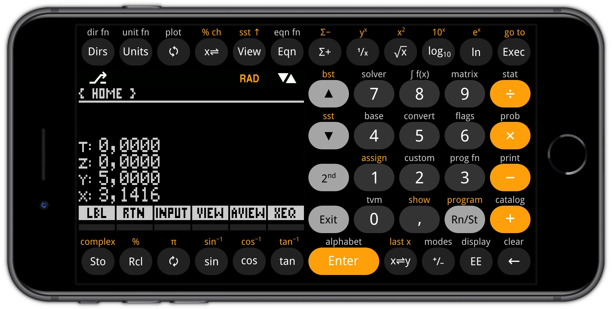

# Calculator Skins

[Free42](https://thomasokken.com/free42/) and [Plus42](https://thomasokken.com/free42/) are emulators of [HP-42S](https://en.wikipedia.org/wiki/HP-42S) calculator developed by Thomas Okken. Nowadays they run on iOS/Android smartphones and Linux/macOS/Windows operating systems.

### jobs-calc skin Free42 samples

 

### jobs+calc skin Plus42 samples

 

### Attributions

Source files are created in [Inkscape](https://inkscape.org/) image editor.

iPhone SE3 screenshots was framed in the [iPhone Frame PNG](https://www.pngall.com/iphone-frame-png/download/133784)
